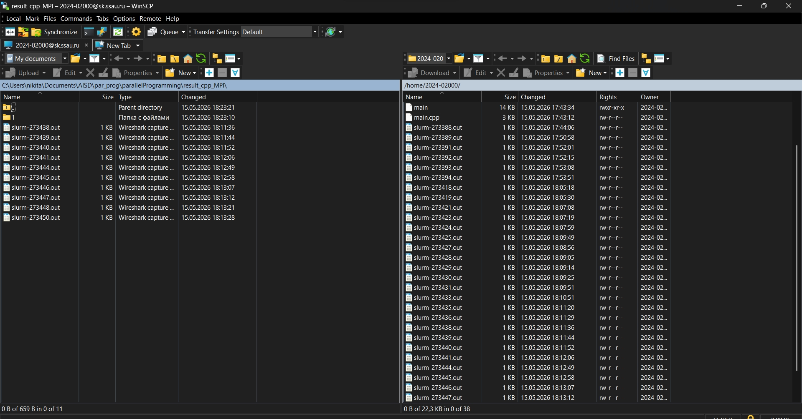

# Лабораторная работа №5

Мной были проведены испытания технологии MPI на суперкомпьютере Королева (код лабораторной работы №3). Для успешной работы код нужно было изменить (добавил генерацию псевдослучайных чисел и последующее заполнение матриц). Все числа прошли проверку. Тестирование производилось на разных размерах матриц и на разном количестве процессов. Результаты тестов представлены в таблице (значения времени представлены в секундах): 

| Размер матрицы | 1 процесс | 2 процесса | 4 процесса | 8 процессов |
|:--------------:|:-------------:|:--------------:|:--------------:|:---------------:|
| 200×200        | 0.065690      | 0.046883       | 0.016885       | 0.012398        |
| 400×400        | 0.565648      | 0.270005       | 0.143639       | 0.075212        |
| 800×800        | 4.292680      | 2.299070       | 1.227730       | 0.606820        |
| 1200×1200      | 13.885300     | 7.085580       | 3.800580       | 1.643030        |
| 1600×1600      | 38.914000     | 20.193800      | 11.347100      | 5.105500        |
| 2000×2000      | 71.029000     | 36.137900      | 18.616400      | 7.687730        |

График зависимости времени выполнения алгоритма от размера массива при разном количестве процессов:

Вывод: Использование MPI на суперкомпьютере Королева позволило значительно сократить время вычислений. Для матрицы 2000 на 2000 время уменьшилось с ~71с до ~7.7с — ускорение в 9.2 раза. При переходе от 1 к 2 процессам наблюдается наибольший относительный прирост производительности, тогда как дальнейшее увеличение процессов дает меньший эффект — это обусловлено накладными расходами на передачу данных между процессами через MPI и ограничениями пропускной способности межпроцессорного взаимодействия. 

P.s. вот скрин с WinSCP:

