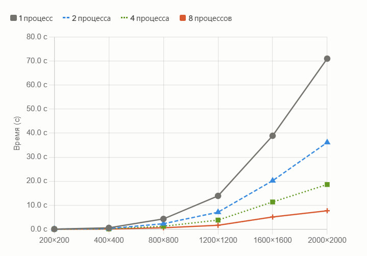

# Лабораторная работа №3

Мной был усовершенствован код лабораторной работы №1 под технологию MPI. Был проведен ряд экспериментов. Все вычисленные матрицы прошли проверку на правильность перемножения. Результативные матрицы и исходные матрицы те же, что и в первой и второй лабораторных работах (увы, из-за большого веса, файлы не смогли добавиться на гитхаб :( ). Тестирование производилось на разных размерах матриц и на разном количестве процессов. Результаты тестов представлены в таблице (значения времени представлены в секундах):
| Размер (N) | 1 процесс | 2 процесса | 4 процесса | 8 процессов |
|:----------:|:---------:|:----------:|:----------:|:-----------:|
| **200** | 0.0289    | 0.0153     | 0.0134     | 0.0066      |
| **400** | 0.2336    | 0.1248     | 0.0705     | 0.0540      |
| **800** | 1.9923    | 1.0148     | 0.5787     | 0.4185      |
| **1200** | 7.0696    | 3.7999     | 2.0019     | 1.4274      |
| **1600** | 17.1781   | 10.0470    | 5.1856     | 3.8372      |
| **2000** | 35.0982   | 21.1977    | 11.0869    | 6.9396      |

График зависимости времени выполнения алгоритма от размера массива при разном количестве процессов:

Вывод: Использование MPI позволило сократить время вычислений для матрицы 2000x2000 с ~35с до ~7с. Замедление роста ускорения на 8 процессах обусловлено архитектурными особенностями процессора (количеством физических ядер) и затратами на передачу сообщений между процессами.
