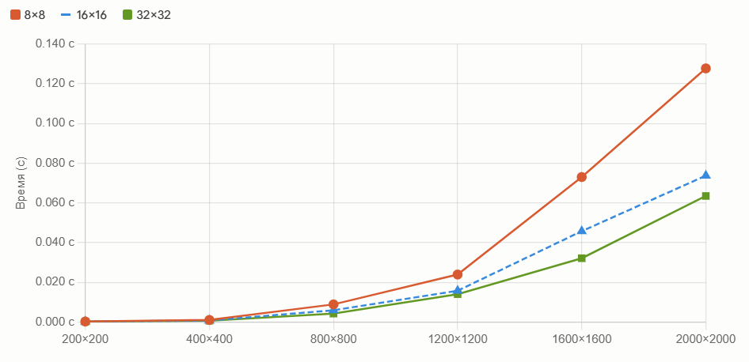

# Лабораторная работа №2

Я добавил к .cpp коду из первой лабораторной работы поддержку OpenMP. Провел ряд экспериментов. Все вычисленные матрицы прошли проверку на правильность перемножения. Результаты экспериментов представлены в таблице (значения времени представлены в секундах):

| Размер матрицы (N) | 1 поток | 2 потока | 4 потока | 8 потоков |
| :--- | :--- | :--- | :--- | :--- |
| **200** | 0.019 | 0.014 | 0.007 | 0.006 |
| **400** | 0.152 | 0.079 | 0.042 | 0.035 |
| **800** | 1.289 | 0.673 | 0.415 | 0.266 |
| **1200** | 4.926 | 2.454 | 1.332 | 0.911 |
| **1600** | 11.984 | 6.487 | 3.121 | 2.147 |
| **2000** | 22.865 | 11.405 | 6.203 | 4.463 |

График зависимости времени выполнения алгоритма от размера массива при разном количестве потоков:

Вывод: для средних и больших матриц, с увеличением количества потоков, технология OpenMP дает неплохой прирост производительности, что нельзя сказать про малые матрицы. Выигрыш у таких матриц от распараллеливания минимален, т.к. всяческие накладные расходы сопоставимы с расходами на математические вычисления.
